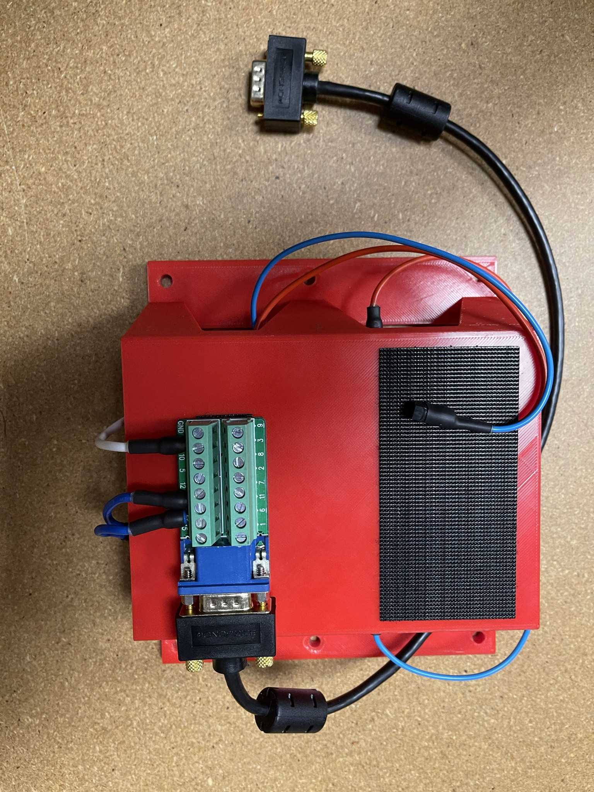
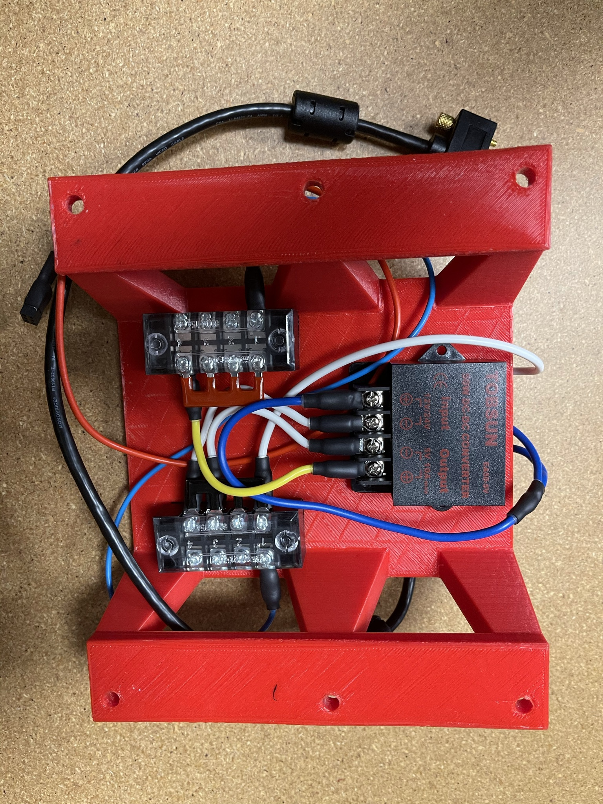
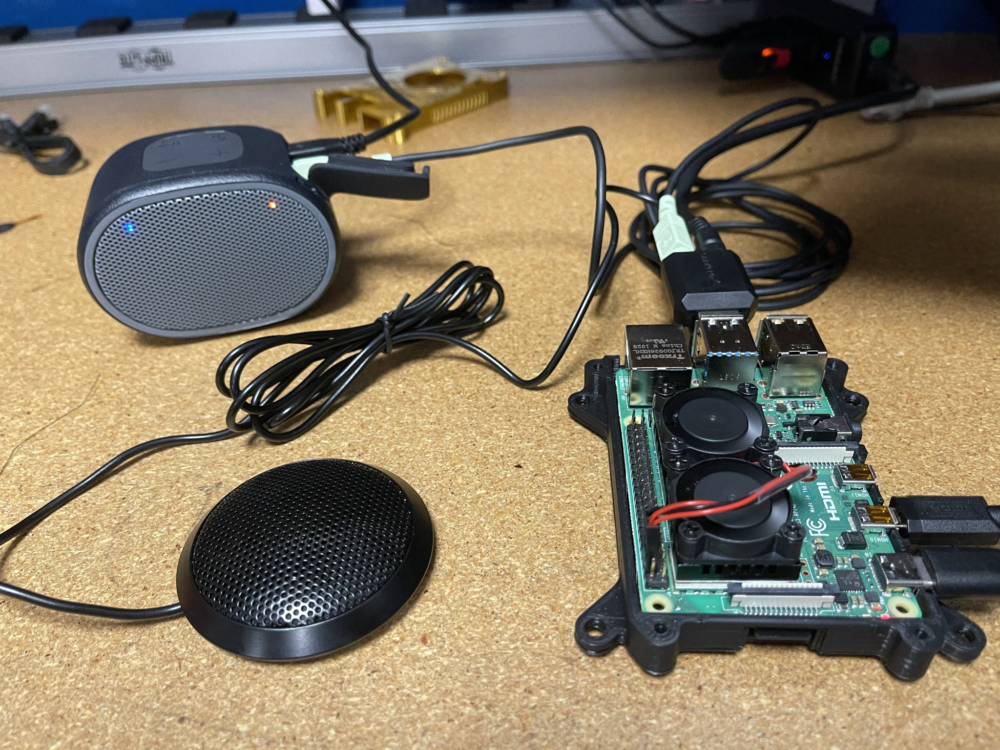

# Spot Voice Control Research
One of the focuses of my research was to integrate voice controls for Spot. I decided to do my development on the Raspberry Pi 4. Other students attempted to use the Raspberry Pi 4 however they were met with power issues. So the first step was getting enough power to run the board on Spot.

---
 

## Power from Spot
Spot uses a HD15 and RJ45 connector on the GXP backpack. Data and commands are sent to Spot via the RJ45. Power is supplied from the HD15 connector, it has the same connector as VGA however the pinout is specific to spot.

 Pin | Specification |
| ----------- | ----------- |
| 1-4, 6 | Ground |
| 7, 8, 11, 12 | 12V |
| 13-14 | 24V |
| 15 | 5V |

The Raspberry Pi operates at 5V, which is fine however the GXP on delivers 2 AMPs for each voltage. The Raspberry Pi 4 requires more than this, consuming around 2.5-3 AMPs.

>2 AMPs @ 5V = 10W 
2 AMPs @ 24V = 48W 

As you can see we can get a lot more power out of the 24V pins compared to the 5V

So I decided to use a voltage converter to get the most available current at 5V. The converter takes 24V as the input and outputs at 5V.
>48W @ 5V = 9.6 AMPs

This allows you to use roughly 9 AMPs at 5V after accounting for losses, you could power 3 Rapberry Pi's!

---
 

## Spot Dev Board
I used the mount made by the Mizzou 3D printing club to create a "test bed" of sorts. This will allow students developing on Spot to easily add or test hardware.     

---

## Voice Control
I researched many solutions when looking to integrate voice control and found [Jasper](http://jasperproject.github.io/documentation/) to be the best solution. Jasper is a python based voice assistant that has a high level of configurability. I chose Jasper because it's one of the only voice assistant platforms that allows for user defined trigger words as I didn't want to be relaying commands through "Hey Google" or "Alexa".

Jasper has some [documentation for installation](http://jasperproject.github.io/documentation/installation/) however these things always come with challenges, especially on a raspberry pi.

The operating system is the latest Ubuntu or Debian 10.

I will walkthrough my successfull installation and setup process.

>$ sudo su -c "echo 'deb [trusted=yes] http://ftp.de.debian.org/debian stretch main' > /etc/apt/sources.list" 
$ sudo su -c "echo 'deb [trusted=yes] http://ftp.debian.org/debian experimental main contrib non-free' > /etc/apt/sources.list.d/experimental.list"
 
$ sudo apt-get update

They public keys will be missing and will need to be added similar to

>$ sudo apt-key adv --keyserver keyserver.ubuntu.com --recv-keys 04EE7237B7D453EC

Then

>$ sudo apt-get update
 
$ sudo apt-get install nano git-core python-dev bison libasound2-dev libportaudio-dev python-pyaudio --yes

create
>$ sudo nano /lib/modprobe.d/jasper.conf

and edit to insert
>\# Load USB audio before the internal soundcard 
>options snd_usb_audio index=0 
>options snd_bcm2835 index=1 
>\# Make sure the sound cards are ordered the correct way in ALSA 
>options snd slots=snd_usb_audio,snd_bcm2835

Then
>$ touch ~/.bash_profile

Insert into that file
>export LD_LIBRARY_PATH="/usr/local/lib" 
source .bashrc

Then
>$ sudo nano ~/.bashrc

Insert into that file
>LD_LIBRARY_PATH="/usr/local/lib" 
export LD_LIBRARY_PATH 
PATH=$PATH:/usr/local/lib/ 
export PATH

Next install Jasper in your users home directory
>$ git clone https://github.com/jasperproject/jasper-client.git jasper 
sudo pip install --upgrade setuptools 
sudo pip install -r jasper/client/requirements.txt 
chmod +x jasper/jasper.py

Jasper has multiple options for speech to text and text to speech engines which is why it's so powerful. I wanted to do all the processing locally, therefore not relying on an internet connection to function as this might not always be available.

I chose PocketSphinx STT engine as it can do local processing.
>$ wget http://downloads.sourceforge.net/project/cmusphinx/sphinxbase/0.8/sphinxbase-0.8.tar.gz 
$ tar -zxvf sphinxbase-0.8.tar.gz 
$ cd ~/sphinxbase-0.8/ 
$ ./configure --enable-fixed --build=aarch64-unknown-linux-gnu 
$ make -j4 
$ sudo make -j4 install 
$ wget http://downloads.sourceforge.net/project/cmusphinx/pocketsphinx/0.8/pocketsphinx-0.8.tar.gz 
$ tar -zxvf pocketsphinx-0.8.tar.gz 
$ cd ~/pocketsphinx-0.8/ 
$ ./configure --build=aarch64-unknown-linux-gnu 
$ make -j4 
$ sudo make -j4 install 
$ cd .. 
$ python -m pip install pocketsphinx 

One issue encoutered was C compiling, some compiles required the " --build=aarch64-unknown-linux-gnu" as they couldn't find it be default. 

### Install CMUCLMTK.

>$ sudo apt-get instPall subversion autoconf libtool automake gfortran g++ --yes 
$ svn co https://svn.code.sf.net/p/cmusphinx/code/trunk/cmuclmtk/ 
$ cd cmuclmtk/ 
$ ./autogen.sh && make -j4 && sudo make -j4 install 
$ cd .. 

### Install Phonetisaurus, m2m-aligner and MITLM
Make sure that the repos and public keys have been imported properly or the packages can't be found on Debian 10!

>$ sudo apt-get update 
$ sudo apt-get -t experimental install phonetisaurus m2m-aligner mitlm libfst-tools

###	Build Phonetisaurus FST model
>$ wget https://www.dropbox.com/s/kfht75czdwucni1/g014b2b.tgz 
$ tar -xvf g014b2b.tgz 
 
$ cd g014b2b/ 
$ ./compile-fst.sh 
$ cd .. 
 
$ mv ~/g014b2b ~/phonetisaurus

### Install TTS Engine eSpeak or SVOX Pico
You also need a text to speech engine. Because the speech to text processing id offline I wanted the text to speech processing to be offline as well. The two main optains are eSpeak and SVOX Pico. These can be picked in the configuration file.
>$ sudo apt-get install espeak

or
>$sudo apt-get install libttspico-utils

### Configuration
The main jasper configuration file needs to be created in "~/.jasper" so in your home directory
>$ mkdir .jasper 
$ sudo nano ~/.jasper/profile.yml

edit this file to configure jasper
>stt_engine: sphinx 
pocketsphinx: 
  fst_model: '/home/murobotics/phonetisaurus/g014b2b.fst' 
  hmm_dir: '/home/murobotics/pocketsphinx-0.8/model/hmm/en_US/hub4wsj_sc_8k' 
#tts_engine: pico-tts 
tts_engine: espeak-tts 
espeak-tts: 
  voice: 'default+m3' 
  pitch_adjustment: 40 
  words_per_minute: 160 

Demo video in images